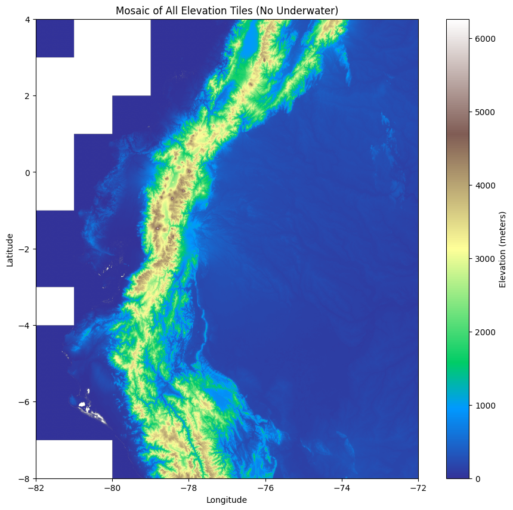
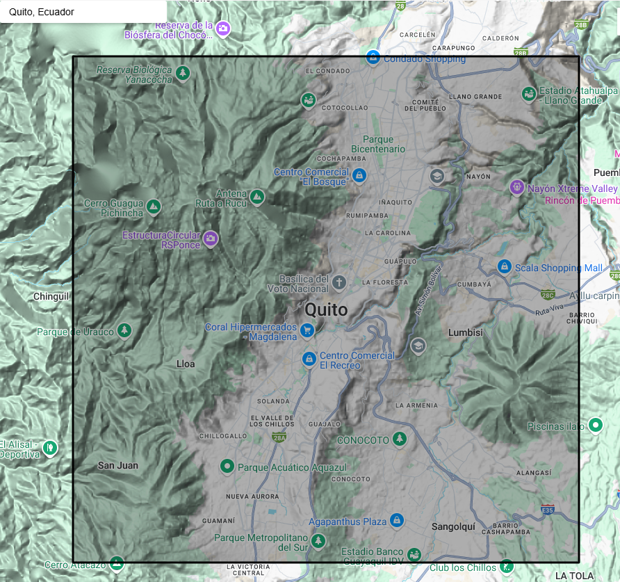
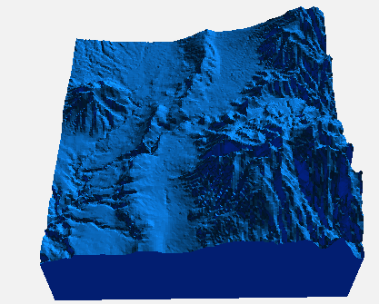
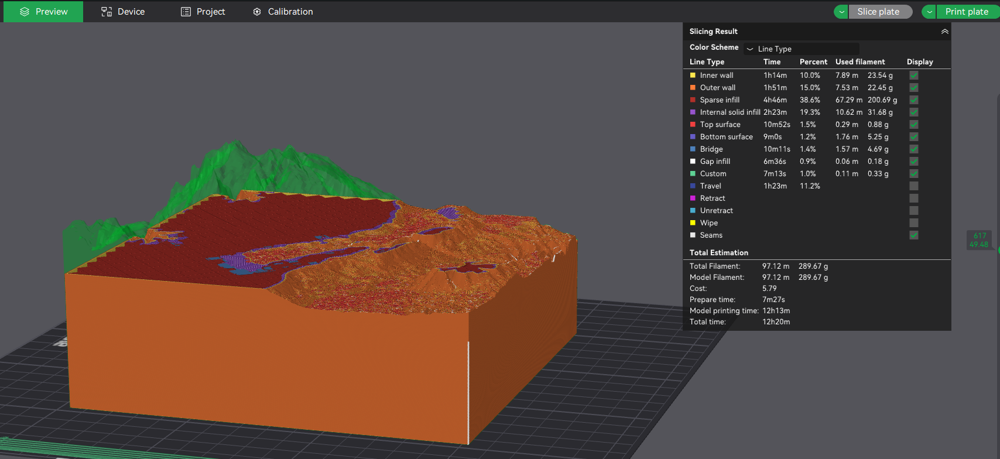

# Proyecto Mapa 3D

En este proyecto se va a trabajar con datos de elevación geográfica. 
El objetivo es crear un objeto para impresión 3D con escala realista en una área determinada. 

# Instrucciones
* Descargue los datos geográficos correspondientes al Ecuador continental de [este enlace](https://viewfinderpanoramas.org/Coverage%20map%20viewfinderpanoramas_org3.htm).
* Filtre y procese los datos para obtener la elevación [m] en función de la latitud y longitud solo del Ecuador.

* Implemente una interfaz gráfica para segmentar un área geográfica. 

* Genere un objeto 3D (extensión stl) en función de la elevación.
<video controls src="assets/map3d.mp4" title="Title"></video>

* Investigue e implemente un algoritmo para suavizar la superficie. 

* Segmente por división política
* Compruebe que su modelo 3D es imprimible (e.g. Bambu Studio). Obtenga los parámetros de impresión (tiempo de impresión, peso, etc). 
