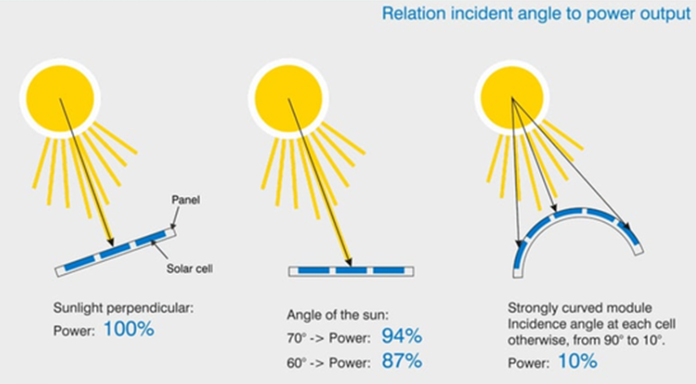
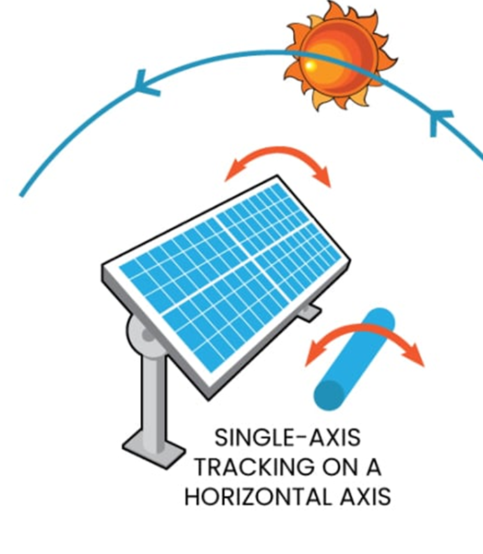
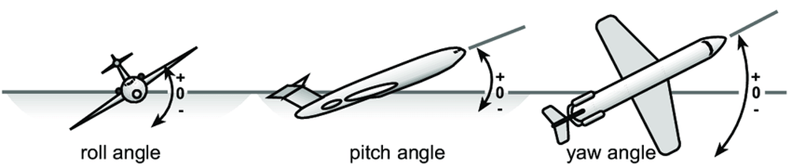

# Descripción
La facultad de Ingeniería Mecánica dispone de varios sistemas de seguimiento solar, uno de ellos se muestra en la siguiente fotografía:


Para este proyecto, se debe realizar el cálculo de los ángulos de control para un seguidor solar de 2 grados de libertad. 

# Seguidor solar
Un seguidor solar es un sistema de orientación para maximizar la exposición a la luz solar. Esto se consigue cuando el panel se orienta perpendicularmente a la luz solar incidente. Cuando el panel no se encuentra perpendicular, la cantidad de energía generada disminuye significativamente.



Los ángulos de control en el seguidor solar de 2 grados de libertad son:

1. $roll$: ángulo de giro alrededor del eje que mira al norte.



2. $pitch$: ángulo de giro alrededor del eje que mira al este.

[**IMPORTANTE**] A diferencia de otro tipo de seguidores solares, la EPN tiene un seguidor solar alrededor del ángulo $pitch$, en lugar del ángulo $yaw$. 


# Posición solar
La posición del sol se mide con respecto a dos ángulos: 
* $\theta$ que es el ángulo de **elevación** del sol con respecto a su proyección en la superficie,
* $\alpha$ que es el ángulo **azimutal** de la proyección del sol en la superficie con respecto al norte.


Con el siguiente snippet de código puede obtener la posición del sol en un lugar (Campus EPN, por defecto) y fecha determinada (fecha y hora actual, por defecto).

```python
from pysolar.solar import get_altitude, get_azimuth
from datetime import datetime
from pytz import timezone


def getSolarPosition(
    latitude: float = -0.2105367,
    longitude: float = -78.491614,
    date: datetime = datetime.now(tz=timezone("America/Guayaquil")),
):
    """Calcula el ``azimuth`` y la ``elevation`` para una posición geográfica (por defecto la EPN) y la fecha ``date``.

    ## Parameters

    ## Return
    ``azimuth``: ángulo en grados desde el norte hasta la projección en la tierra [0 -> 360).
    ``elevation``: ángulo del sol hacia la proyección en la tierra [-90 -> 90].

    """

    az = get_azimuth(latitude, longitude, date)
    el = get_altitude(latitude, longitude, date)

    return az, el


getSolarPosition()
```

# Objetivo
* [**IMPORTANTE**] Realizar el desarrollo matemático para calcular los 2 ángulos de control ($pitch$ y $roll$) en base a la posición solar (elevación $\theta$ y azimuth $\alpha$).
* Implementar un programa que permita calcular los ángulos de control para un seguidor solar de 2 grados de libertad.
* Dibujar la trayectoria del sol y del panel solar para un día determinado.
* El panel solar debe ser perpendicular a la luz solar incidente.
* El programa debe permitir ingresar la fecha y duración de la simulación, y graficar de manera interactiva la trayectoria del panel solar.
* Realice un video de máximo 30 segundos del uso de su programa.


